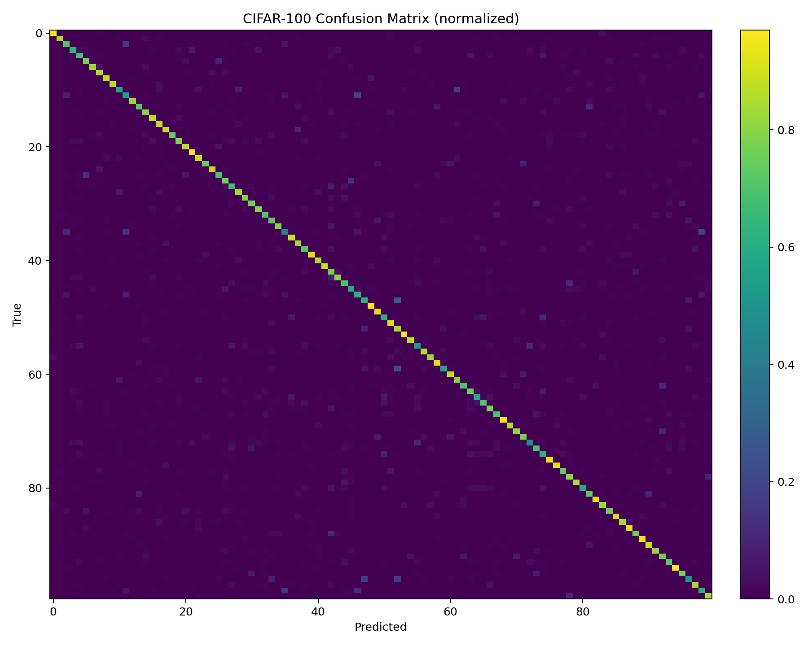

CIFAR-100 image classification with TensorFlow/Keras. Includes CNN baseline and EfficientNetV2B0 transfer learning, staged fine-tuning, and evaluation metrics.

Get the latest trained weights from the **[Releases](../../releases/latest)** page:
- [`final_efficientnetv2b0.keras`](../../releases/latest/download/final_efficientnetv2b0.keras) — transfer model (EfficientNetV2B0)
- [`final_cifar100_cnn.keras`](../../releases/latest/download/final_cifar100_cnn.keras) — baseline CNN

CNN baseline + EfficientNetV2B0 transfer learning in Keras/TensorFlow.
- Training notebook lives in `notebooks/`
- Metrics & plots are in `results/`
- Large model weights will be attached in **Releases** (GitHub limits uploads >25MB in the repo).

[](https://colab.research.google.com/github/kiko1992-creator/cifar100-image-classification/blob/main/notebooks/image%20classification%20final.ipynb)

# EfficientNetV2B0 transfer model
python predict.py path/to/image.jpg --weights final_efficientnetv2b0.keras

# Or the small CNN baseline
python predict.py path/to/image.jpg --weights final_cifar100_cnn.keras

**Load a model in Python**
m = tf.keras.models.load_model("final_efficientnetv2b0.keras")  # or final_cifar100_cnn.keras

## Inference (CLI)
Download a weight file from **Releases** (see links above), then run:

```bash
pip install -r requirements.txt
python predict.py path/to/image.jpg --weights final_efficientnetv2b0.keras --topk 5
# or the small baseline:
python predict.py path/to/image.jpg --weights final_cifar100_cnn.keras --topk 5

## Results
The EfficientNetV2B0 transfer model significantly outperformed the small CNN baseline.

**EfficientNetV2B0 (transfer learning)**
- Top-1 accuracy: **78.2%**
- Top-5 accuracy: **95.9%**

Artifacts:
- [`results/metrics_transfer.json`](results/metrics_transfer.json)
- [`results/metrics_cnn.json`](results/metrics_cnn.json)
- [`results/classification_report.txt`](results/classification_report.txt)

### Confusion Matrix (normalized)

